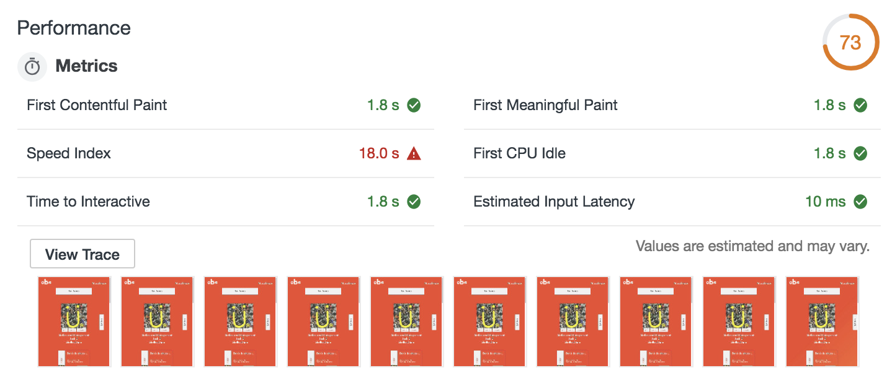
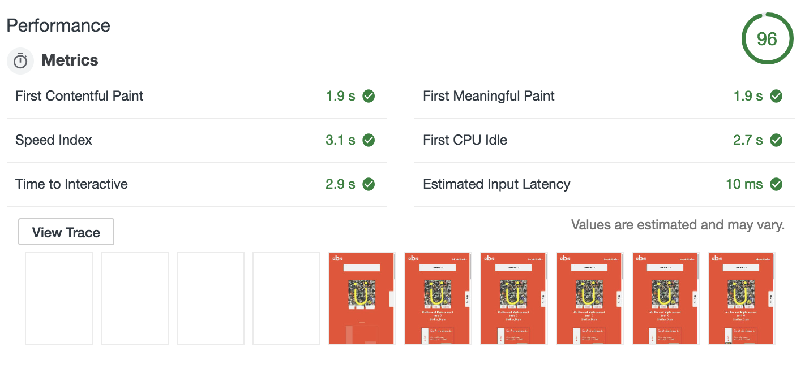
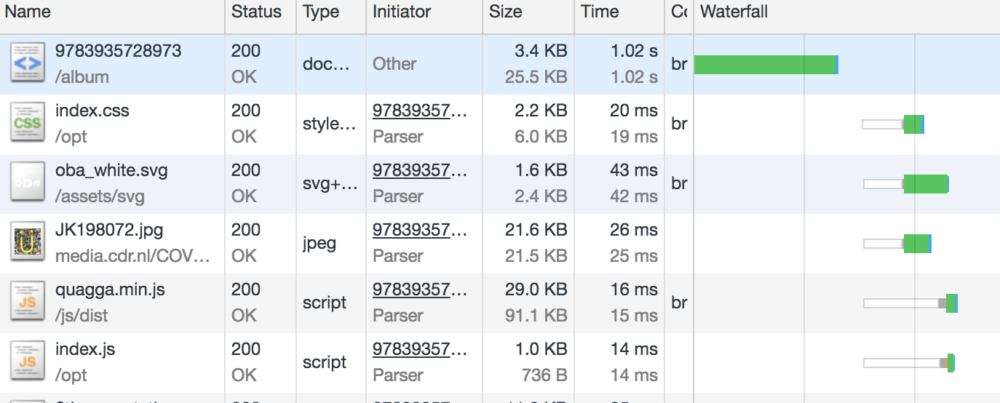

# OBA Musicfinder[🔥 Enhanced Edition 🔥]

## Running the App

To run the app locally you can Clone this repo

```bash
    git clone https://github.com/Senpaizuri/performance-matters-1819.git
```

Next, you should run this line to start the app. ez pz lemon squeezy 🍋

```bash
    npm i && npm start
```

__The app can also be found [here 🔥](https://performancebois.herokuapp.com/)__

### Base features
__________________

This app allows you to find music albums within the oba api with enhanced performance. This app is based on the it's previous itteration found [here](https://senpaizuri.github.io/project-1-1819/#album-9783935728973)

## NPM Scripts
__________________

This build includes a few npm scripts

```json
    "scripts": {
        "start": "gulp build && node server.js",
        "minimize": "gulp build",
        "expose": "npx ngrok http 3000"
    }
```

* *start* -> Builds new files to the "/opt/" directory and boots the node server
* *minimize* -> Build new files
* *expose* -> Exposes the localhost:3000 to an online IP with NGROK easier online testing and tooling

## Serverside Node
__________________

The Node server runs with [Express.js 🚅](https://expressjs.com/) and handles the templating with [handlebars 👨🏻](https://handlebarsjs.com/)
Furthermore, [Gulp 🍹](https://gulpjs.com/) is used for tooling.

[Gulp 🍹](https://gulpjs.com/) handles the building of minimized files.
[Gulp 🍹](https://gulpjs.com/) has a few extra dependencies within.
Namely `CSSNANO` and `Uglify` to help minify the css and js respectively.

# Optimizations 🏃🏻

> Sonic is my name, Speeds my game 🏃🏻 - Sonic 20XX

The app itself was pretty slow.
Namely Bad loadtimes with regards to fonts and api calls.
The original demo can be found [here](https://senpaizuri.github.io/project-1-1819/).

The app was rendered almost exclusively on the client.
This caused some mayor perfomance issues on slower connections.

With a first paint at __10s__ ,first meaningfull paint after __16.7__ seconds and a recorde speed index of __18s__ 😅



## Step 1 - ServerSide Rendering 💻
__________________

I started out with server side rending.
Let all "heavy lifting" 🏋🏻‍ be done serverside.

This change alone showed reasonable improvements.



The first paint was after __1.9s__, first meaningfull paint after __1.9s__ and a speed index of  __3.1s__

With server side rendering alone is saved about 15ish seconds

That's huge 🌎

## Step 2 - Minifying and Compression 🔍 & 📚
__________________

### Minify 🔍
__________________

Secondly I wanted to serve minified files.
I was intrested in [Gulp 🍹](https://gulpjs.com/) so I picked that that up for this perticular task.

Within gulp I used 2 Dependencies for minification:
* *CSSNano*
* *Uglify*

My `gulpfile.js` contained 3 tasks
```javascript
    gulp.task("js",async()=>{ 
        // Task JS, Minified and build new JS
    })

    gulp.task("css",async()=>{
        // Task CSS, Minified and build new CSS
    })

    gulp.task("build",gulp.parallel("js","css"))
    // Task Build, Runs both JS and CSS task
```

I also used npm scripts to define easier building/minifying as mentioned above with the NPM scripts.

### Compression 📚
__________________

Next I had to compress the files.
I used [Shrinkray](https://www.npmjs.com/package/shrink-ray) for this.
This package can compress files into `gzip` and `brotli` formats.

The request headers usually give an encoding type for it's files.
If I'm not mistaken [Shrinkray](https://www.npmjs.com/package/shrink-ray) can now determine which compression method to apply so it can send the appropriate files to the browser.

The encoding and minifying did shave of a few bytes from the original files along with load time (duh)

however, the files were so small that the encoding itself didn't matter much.



## Step 3 - Custom Fonts 🔡
__________________

The next item on my list, Fonts.
Since css is render blocking nothing will be shown until the css is downloaded and parsed ect ect.
I didn't pay close attention to this and kinda messed up.
At the time is was still using a Google font. I tried to preload the dns which worked. but couldn't get the page to show the content without the need for the external font.
So I tried the `font-dispay:swap;`. Didn't work. Frustration ensued

Later I learned that `font-display:swap;` had to be defined within the `@font-face`.
So I started to host the font myself.
Kablam, the first text showed up along with the first paint.
The gap from no content to content shown had shrunk by a good 2s since the font didn't need to be loaded from an external source and the font wouldn't be necessary thanks to `font-display:swap;`

## Step 4 - Critical CSS 🚨
__________________

Percieved perfomance can and will enhance the users experience.
To achieve this we can use a trick with css, Critical CSS 🚨.
Critical CSS is a piece of your css file. 
It's supposed to only contain the css for what's immediately shown above the fold of your magnificent ✨web page.
This will up the percieved performance as the rest of the css file is loaded in later and will supplement the rest of the css.

I first tried to create the Critical CSS on my own, but failed. It was usable for the most part. But it lacked certain important items.
Then I found an online tool [Critical CSS Generator](https://jonassebastianohlsson.com/criticalpathcssgenerator/).
You can throw you're site at it and it smacks you in the face with the Critical CSS 🚨 that you can just copy paste into your html file.

Optimally you'd automize it. Everytime you change your CSS the Critical CSS 🚨 is regenerated to fit your needs. However, since I didn't find a need to constantly keep changing my CSS or HTML I had no need for this 🤷‍.

## Step 5 - Service Worker 👨‍💻
___________________


<!-- Add a link to your live demo in Github Pages 🌐-->

<!-- ☝️ replace this description with a description of your own work -->

<!-- Add a nice image here at the end of the week, showing off your shiny frontend 📸 -->

<!-- Maybe a table of contents here? 📚 -->

<!-- How about a section that describes how to install this project? 🤓 -->

<!-- ...but how does one use this project? What are its features 🤔 -->

<!-- What external data source is featured in your project and what are its properties 🌠 -->

<!-- Maybe a checklist of done stuff and stuff still on your wishlist? ✅ -->

<!-- How about a license here? 📜 (or is it a licence?) 🤷 -->
